# USGS Mineral Resources Data System (MRDS) Complete Database Structure

## Overview

The USGS MRDS is a comprehensive database containing information about mineral resources. The database is organized around mineral deposits (identified by dep_id) with extensive related information spread across multiple specialized tables.

## Core Tables and Relationships

```mermaid
erDiagram
    %% Core Entity
    MRDS ||--o{ Deposits : describes
    MRDS ||--o{ Names : has
    MRDS ||--o{ Dups : links

    %% Location Information
    MRDS ||--o{ Location : has
    MRDS ||--o{ Coords : has
    MRDS ||--o{ Plss_coordinates : has
    MRDS ||--o{ Districts : belongs_to
    MRDS ||--o{ Place : references
    MRDS ||--o{ Physiography : located_in

    %% Geological Information
    MRDS ||--o{ Rocks : contains
    MRDS ||--o{ Ages : dated_by
    MRDS ||--o{ Structure : features
    MRDS ||--o{ Tectonic : setting
    MRDS ||--o{ Alteration : shows
    MRDS ||--o{ Orebody : contains
    MRDS ||--o{ Materials : composed_of

    %% Economic Information
    MRDS ||--o{ Commodity : produces
    MRDS ||--o{ Production : records
    Production ||--o{ Production_detail : details
    MRDS ||--o{ Resources : contains
    Resources ||--o{ Resource_detail : details
    MRDS ||--o{ Ownership : owned_by
    MRDS ||--o{ Holdings : held_by

    %% Technical Information
    MRDS ||--o{ Workings : developed_by
    MRDS ||--o{ Conc_proc : processed_by
    MRDS ||--o{ Ore_control : controlled_by
    MRDS ||--o{ Model : classified_by

    %% Administrative Information
    MRDS ||--o{ Land_status : governed_by
    MRDS ||--o{ Reporter : reported_by
    MRDS ||--o{ Comments : documented_by
    MRDS ||--o{ Other_dbs : referenced_in
    MRDS ||--o{ Analytical_data : analyzed_by
    MRDS ||--o{ Groupings : grouped_in

    %% Metadata Tables
    About
    Accession
    Datadxny

    MRDS {
        string dep_id PK
        string name
        string dev_stat
        string code_list
        float longitude
        float latitude
    }

    Deposits {
        string dep_id FK
        string rec_tp
        string dev_st
        string dep_tp
        string min_meth
        string mill_meth
        string mas_id
        string mrds_id
    }

    Production {
        string dep_id FK
        string yr
        float mined
        string units
    }

    Resources {
        string dep_id FK
        string yr
        float tot_resources
        string units
    }
```

## Table Categories

### 1. Core Identity Tables
- **MRDS.txt**: Primary deposit information
- **Deposits.txt**: Detailed deposit characteristics
- **Names.txt**: Alternative names
- **Dups.txt**: Duplicate/related record links

### 2. Location Tables
- **Location.txt**: Administrative location
- **Coords.txt**: Coordinate information
- **Plss_coordinates.txt**: Public Land Survey System
- **Districts.txt**: Mining districts
- **Place.txt**: Place references
- **Physiography.txt**: Physiographic information

### 3. Geological Tables
- **Rocks.txt**: Rock types and descriptions
- **Ages.txt**: Geological ages
- **Structure.txt**: Structural features
- **Tectonic.txt**: Tectonic settings
- **Alteration.txt**: Alteration characteristics
- **Orebody.txt**: Orebody characteristics
- **Materials.txt**: Material compositions

### 4. Economic Tables
- **Commodity.txt**: Commodity information
- **Production.txt**: Production records
- **Production_detail.txt**: Detailed production data
- **Resources.txt**: Resource estimates
- **Resource_detail.txt**: Detailed resource data
- **Ownership.txt**: Ownership information
- **Holdings.txt**: Property holdings

### 5. Technical Tables
- **Workings.txt**: Mining workings
- **Conc_proc.txt**: Concentration processes
- **Ore_control.txt**: Ore control factors
- **Model.txt**: Deposit models

### 6. Administrative Tables
- **Land_status.txt**: Land status
- **Reporter.txt**: Information sources
- **Comments.txt**: Additional notes
- **Other_dbs.txt**: Cross-references
- **Analytical_data.txt**: Analysis results
- **Groupings.txt**: Grouping information

### 7. Metadata Tables
- **About.txt**: Database documentation
- **Accession.txt**: Access information
- **Datadxny.txt**: Data dictionary

## Key Relationships

1. **Primary Key Relationships**
   - dep_id is the primary key in MRDS.txt
   - All related tables use dep_id as a foreign key
   - Some tables have compound keys (dep_id + line/rec)

2. **Secondary Keys**
   - mas_id and mrds_id in Deposits.txt link to other databases
   - company_id in Ownership.txt for company relationships
   - Various code fields (commod_code, p_code, etc.) for standardization

3. **Temporal Relationships**
   - yr field in Production.txt and Resources.txt
   - Various date fields across tables

4. **Hierarchical Relationships**
   - Rock classification hierarchy
   - Physiographic classification
   - Commodity groupings

## Data Model Characteristics

1. **Star Schema Structure**
   - MRDS.txt at the center
   - Related tables providing different aspects of information
   - Detail tables for production and resources

2. **Multiple Record Support**
   - line/rec fields for multiple entries
   - Temporal tracking through year fields
   - Alternative names and classifications

3. **Standardization**
   - Code fields for consistent classification
   - Unit fields for measurements
   - Status and type fields for categorization

4. **Cross-referencing**
   - Links to other databases
   - Internal relationships between records
   - Geographic reference systems

## Best Practices for Implementation

1. **Database Design**
   - Implement as a relational database
   - Maintain referential integrity through foreign keys
   - Consider materialized views for common queries

2. **Data Access**
   - Use MRDS.txt as the entry point
   - Join with related tables based on need
   - Consider caching for frequently accessed data

3. **Data Validation**
   - Enforce referential integrity
   - Validate codes against standard lists
   - Check measurement units for consistency

4. **Performance Optimization**
   - Index dep_id across all tables
   - Create composite indexes for compound keys
   - Consider partitioning for large tables

This structure supports comprehensive mineral resource documentation while maintaining data integrity and enabling efficient querying and analysis.
