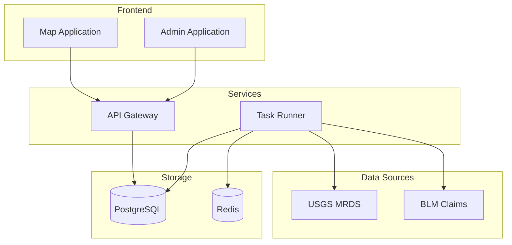
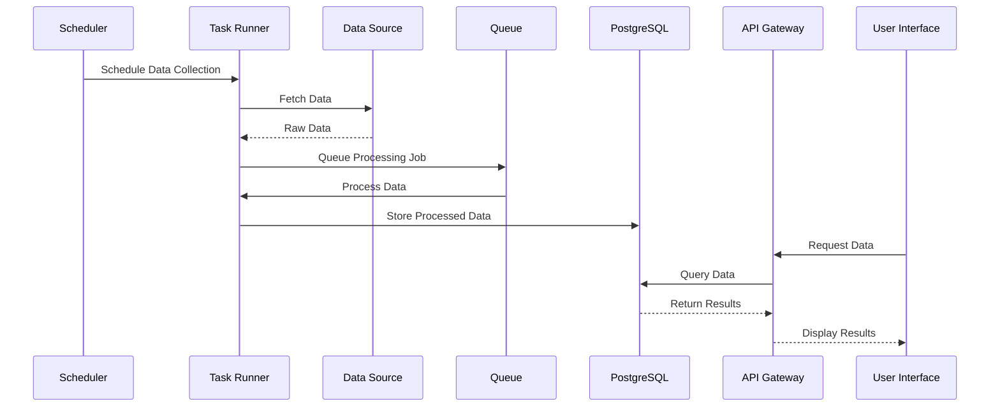
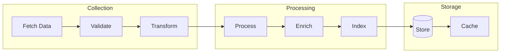
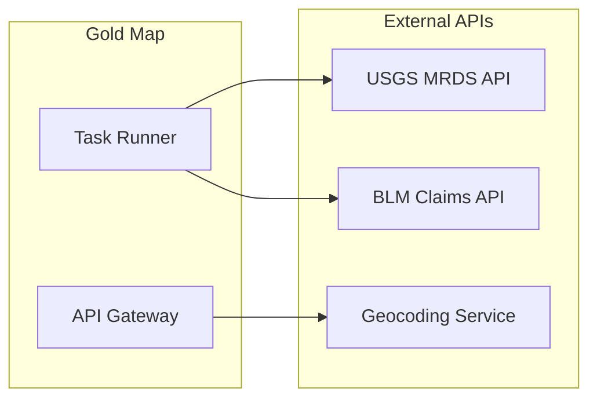
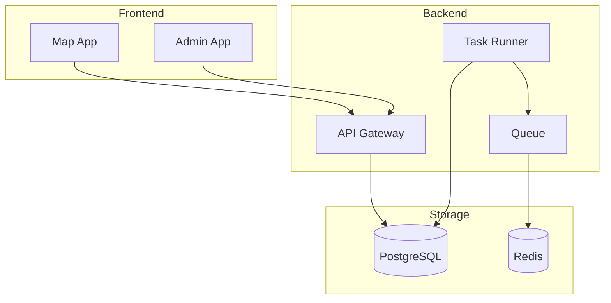
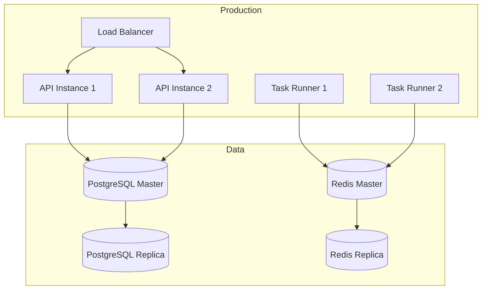
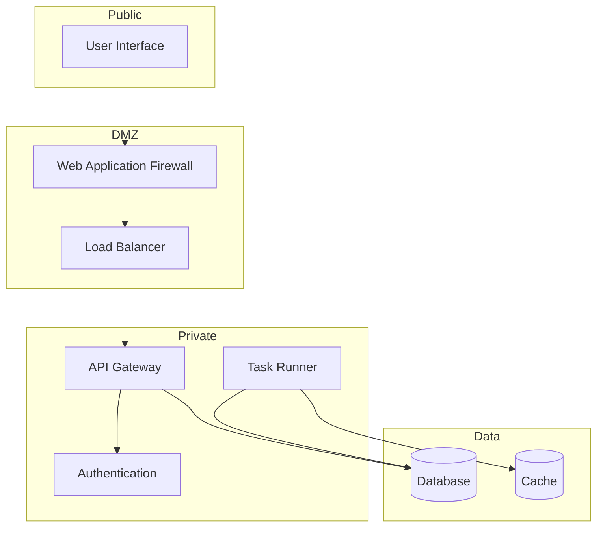

# Gold Map Architecture

## System Overview

Gold Map uses a modular, microservices-based architecture to collect, process, and serve geospatial data from various sources. The system is built with TypeScript and follows modern development practices.

## Component Architecture

## Data Flow

## Component Details

### Frontend Applications

1. Map Application
   - Public-facing web map
   - Interactive data visualization
   - Data filtering and search

2. Admin Application
   - Job management
   - System monitoring
   - Configuration management

### Backend Services

1. Task Runner
   - Job scheduling
   - Data collection
   - Data processing
   - Queue management

2. API Gateway
   - Data access
   - Authentication
   - Rate limiting
   - Caching

## Data Processing Pipeline

## Integration Points

### External Services

### Internal Communication

## Deployment Architecture

## Security Architecture

## Configuration Management

The system uses a hierarchical configuration system:

1. Environment Variables
2. Configuration Files
3. Database Settings
4. Runtime Configuration

See [Configuration Guide](../operations/configuration.md) for details.

## Monitoring & Logging

The system implements comprehensive monitoring:

1. Application Metrics
2. System Health
3. Job Status
4. Error Tracking

See [Monitoring Guide](../operations/monitoring.md) for details.

## Scaling Considerations

The architecture supports horizontal scaling through:

1. Stateless Services
2. Queue-based Processing
3. Read Replicas
4. Caching Layers

See [Scaling Guide](../operations/scaling.md) for details.
